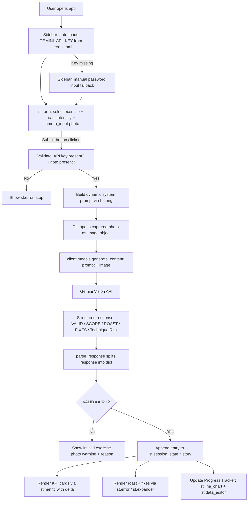

# System Architecture — Roast My Form

## 1. Overview

Roast My Form is a single-page Streamlit application that combines browser-based
camera capture with Gemini's multimodal vision reasoning to deliver
tone-adjustable exercise-form feedback from a captured posture image.

## 2. Data Flow Diagram



## 3. Module Breakdown

| Module | Responsibility |
|---|---|
| **Config Layer** (sidebar) | Auto-loads `GEMINI_API_KEY` from `st.secrets`; falls back to a manual password field only if `secrets.toml` isn't configured. Lets user pick model (`gemini-3.6-flash`, `gemini-3.5-flash`, `gemini-3.1-flash-lite`, `gemini-3.1-pro-preview`) |
| **Input Layer** (`st.form`) | Batches exercise choice (18 supported exercises), roast intensity, and camera photo into a single atomic submission — prevents redundant API calls on every widget interaction |
| **Prompt Engine** (`build_system_prompt`) | Dynamically injects exercise type and tone into a structured instruction template. First instructs the model to verify the photo is a genuine attempt at that exercise's starting posture; only analyzes biomechanics if valid |
| **Inference Layer** | Sends the prompt + image to Gemini Vision via the `google-genai` SDK (`client.models.generate_content`), receives a structured text block |
| **Parsing Layer** (`parse_response`) | Deterministically extracts `valid`, `reason`, `score`, `roast`, `fixes`, `injury_risk` from the model's structured output |
| **State Layer** (`st.session_state.history`) | Persists every *valid, scored* analysis across Streamlit reruns for the life of the session, powering trend charts. Invalid submissions are shown but not logged, so they don't skew the average score |
| **Presentation Layer** | KPI cards (`st.metric` with delta), roast callout (`st.error`), fixes (`st.expander`), invalid-photo warning (`st.warning`), trend chart (`st.line_chart`), editable log (`st.data_editor`) |

## 4. API Integration Strategy

- **Single call per submission**: because the photo and settings live inside an
  `st.form`, Streamlit does not re-run the Gemini call on every widget change —
  only on explicit submit. This directly optimizes API quota/cost.
- **Multimodal payload**: `client.models.generate_content(model=..., contents=[prompt, image])`
  sends both the text instruction and the raw image in one request, letting
  Gemini reason over pixels and text jointly rather than requiring a separate
  captioning step.
- **Validity-gated output contract**: the prompt forces a `VALID: Yes/No` field
  before anything else. If `No`, the model must return only `VALID` and
  `REASON` — no score is generated for a photo that doesn't match the exercise.
  If `Yes`, it must return the full `SCORE / ROAST / FIXES / INJURY_RISK`
  block. This keeps the app from fabricating a form score for images that
  aren't actually attempts at the exercise.
- **SDK note**: this project uses `google-genai` (`from google import genai`,
  `genai.Client(api_key=...)`), the current unified Google GenAI SDK. The
  older `google-generativeai` package (`genai.configure()` +
  `genai.GenerativeModel(...)`) is deprecated and no longer installable.

## 5. State Management

`st.session_state.history` is a list of dictionaries, one per **valid**
analysis:

```python
{
  "timestamp": "2026-08-12 10:03:00",
  "exercise": "Squat",
  "intensity": "Savage Gym Bro",
  "score": 4,
  "roast": "...",
  "fixes": "...",
  "injury_risk": "Medium"
}
```

Invalid submissions (photo doesn't match the selected exercise) are rendered
as a warning but never written to `history`, so the KPI deltas, average score,
and trend chart only ever reflect genuine attempts. This list is the single
source of truth for both the score-delta comparison and the trend chart, and
it survives Streamlit's rerun-on-every-interaction model without needing an
external database.

## 6. Deployment Notes

- Target platforms: **Streamlit Community Cloud**, **Hugging Face Spaces**, or **Render**.
- `requirements.txt` is pinned to pure-Python packages with no OS-level
  dependencies, so it builds cleanly in a minimal container.
- The Gemini API key is supplied via `.streamlit/secrets.toml` locally, or the
  platform's **secrets manager** (e.g. Streamlit Community Cloud's
  `Settings → Secrets`) in production — never committed to the repo.
  `.streamlit/secrets.toml.example` is committed instead, as a template.